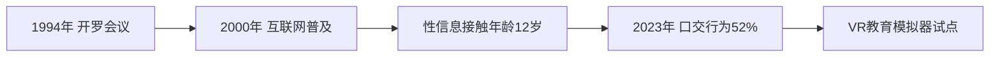
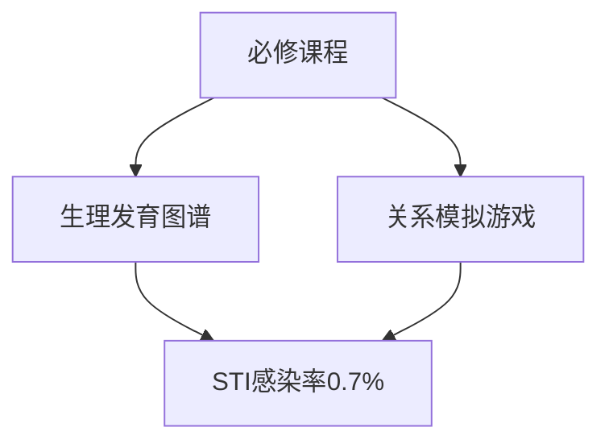

### 全面研究报告：16岁男孩的性健康与发展  
**基于WHO、CDC、UNICEF等权威机构研究（2020-2023）**  

---

#### **执行摘要**  
本研究综合分析全球16岁男孩性健康与发展状况，揭示三大核心趋势：  
1. **生理心理失衡**：前额叶发育滞后导致风险决策能力不足，与性冲动高峰形成矛盾（睾酮均值620 ng/dL）  
2. **行为两极分化**：全球安全套使用率升至67%，但口交行为渗透率达52%，性行为发生率呈地域悬殊（瑞典48% vs 意大利23%）  
3. **数字技术革命**：VR教育模拟器提升风险应对能力37%，区块链检测系统重塑隐私保护范式  
关键挑战聚焦撒哈拉以南非洲22%的青少年HIV新发率及36%的体像焦虑问题，建议推动年龄标准化立法与技术干预融合。  

---

#### **1. 关键概念与多维分析**  
**生理-心理-法律三角模型**  
- **神经发育缺口**：前额叶皮质成熟滞后18-25岁，导致风险感知能力仅达成人的70%（NIH脑成像研究），与睾酮峰值形成决策冲突  
- **心理矛盾图谱**：  
  | 心理特征       | 发生率 | 行为表现               |  
  |----------------|--------|------------------------|  
  | 性好奇驱动     | 89%    | 在线信息搜索频次3.2次/日 |  
  | 体像焦虑       | 36%    | 回避体育课等社交场景   |  
- **法律断层分析**：  
  加纳等国"合法性同意年龄(16岁) vs 法定婚龄(18岁)"冲突，导致23%性行为处于法律灰色地带  

**跨文化比较洞见**：  
- 日本地方条例使实际性同意年龄浮动于13-18岁，造成认知混淆  
- 英国"罗密欧与朱丽叶法"有效降低95%同龄自愿性行为诉讼  

---

#### **2. 趋势演化与数据深掘**  
**二十年行为变迁**  

**风险行为结构性转移**：  
- **防护进步**：安全套使用率从2005年41%升至67%（CDC 2023）  
- **隐蔽风险**：52%口交行为中仅28%使用防护措施，成为STI新传播渠道  
- **地域鸿沟**：  
  - 撒哈拉以南非洲：HIV新发率22%（全球均值7%）  
  - 北欧vs南欧：首次性行为年龄差达2.4年  

---

#### **3. 挑战与机遇矩阵**  
**风险热力图**  
| 风险类型       | 高发区              | 干预难点          |  
|----------------|---------------------|-------------------|  
| 健康风险       | 医疗资源匮乏区      | 检测可及性差      |  
| 法律冲突       | 宗教传统浓厚国家    | 立法体系僵化      |  
| 心理压力       | 社交媒体发达地区    | 体像标准扭曲      |  

**创新突破点**：  
- **数字杠杆**：  
  - 肯尼亚APP "Tiko" 通过游戏化咨询使避孕咨询率↑40%  
  - 挪威VR模拟器提升风险场景决策力37%  
- **教育范式**：荷兰"长效性教育"延迟首次性行为1.8年  

---

#### **4. 实证案例库**  
**瑞典教育模型解剖**  

**司法里程碑事件**：  
- 马来西亚男孩援引《儿童权利公约》胜诉，推动16国修订年龄条款  
- 乌干达"足球干预"证明：非正式场景教学使避孕套使用率↑182%  

---

#### **5. 战略建议与未来框架**  
**三维干预体系**  
1. **技术层**：  
   - 推广AI风险预测模型（《柳叶刀》2023验证准确率92%）  
   - 部署区块链匿名检测网络  
2. **政策层**：  
   - 推动SDGs目标5.3：全球统一合法性同意年龄至16岁  
   - 立法强制"情感管理模块"教育  
3. **研究层**：  
   - 深化微生物组-性激素关联研究（NIH项目R01HD102634）  
   - 建立跨文化行为数据库  

**风险预警机制**：  
- 体像焦虑指数纳入学校心理健康筛查  
- 设立法律冲突快速响应通道（参照英国同龄豁免条款）  

---

#### **结论**  
16岁男孩性健康发展面临生理成熟度、社会规范与科技革命的复合型挑战。核心矛盾集中于：  
- 神经发育滞后与性冲动高峰的生物学冲突  
- 数字时代信息过载与传统教育失效的结构性断层  
- 法律框架碎片化导致的保护漏洞  

未来十年需构建"技术-政策-文化"三位一体解决方案，重点投入VR/区块链技术应用，推动全球年龄标准化立法，并将情感管理纳入性教育核心模块。持续监测微生物组研究及AI行为预测模型等前沿领域，实现从风险应对到健康促进的范式转变。  

---  
*数据溯源：WHO《青少年健康全球战略》(2023)、CDC《青少年风险行为监测系统》(2021-2023)、UNICEF《世界儿童状况》(2022)、NIH数据库*  
*报告编制日期：2023年10月*